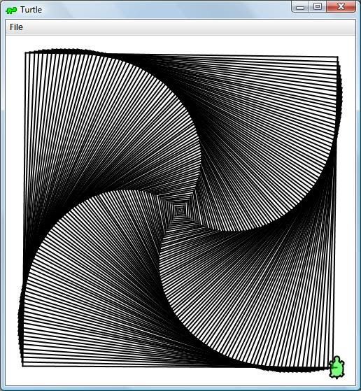

# Turtle Tutorial

## Turtle Graphics 

In this tutorial, you'll learn how to use a **software library** called Java-Turtle that lets you write code to draw visual graphics. A **software library** is a collection of classes, methods, and/or other components that you can use in your code. **Java-Turtle** is a software library that supports drawing visual graphics using what's called a Turtle. 

Java-Turtle is just one example of a turtle graphics library. There are many different turtle libraries packages for many different programming languages, and turtle graphics has long been used to teach programming to new coders!

You can draw very interesting graphics like the one below:

## Documentation

One key part of using a software library is reading the documentation of that library so that you can learn how to use the components of the library. **Documentation** is a reference that describes the classes, methods, etc. available in a software library, and how to use them.
= Here is the documentation for Java-Turtle: https://cse12x.pages.cs.washington.edu/121/turtles/docs/Turtle.html 

- Programmers of all skill levels constantly refer to documentation as they write code.

- Reading software documentation is a skill you'll learn in this course. Don't worry, we don't expect you to fully understand documentation right away! 

In this assignment, we'll walk you through some key functionality of the Java-Turtle library.

## Constructing a Turtle

