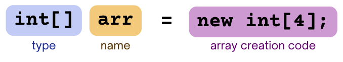
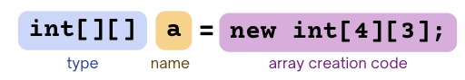

# 2D Arrays


## Review of Arrays

Recall that arrays in Java obey a few specific rules: 

* Each compartment in the array has an *index* that refers to its position starting with index 0 at the very "front" of the array, and each compartment can hold a *single element.* 

* Arrays can only hold values that share the same type. In the example above, `arr` is an array that holds all `int` values. If we tried to put something like the `String` `"hello"` or the `double` `3.14159` into it, Java would complain (with a compiler error). 

* We have to specify how many elements we want the array to be able to hold (or its "length") when we first create it. In the example below, the `4` on the right hand side of the assignment operator dictates that `arr` with have space for 4 elements. 

The syntax for constructing an array variable is as follows: 



Notice here that `int[]` is the *type* of an "array of integers." So an array of integers with length 4 has room to store **4 `int` values at the same time.**

You can make arrays that hold values of *any type.* For example, `String[]` is the type of an array of `String`s, `double[]` is the type of an array of `double`s, and so on. 


## Two-Dimensional (2D) Arrays 

So given the previous statement: "You can make arrays that hold values of *any type.*" combined with the statement that "`int[]` is the *type* of an 'array of integers'." you might wonder...could you make an array of...arrays? 

:::{admonition} Tip
:class: tip

YES YOU CAN!
:::

We refer to an array of arrays as a "two-dimensional array." So essentially each element of the two-dimensional array is another array itself! 


### Creating an Array

Here you can see the syntax for creating a two-dimensional array of integers. 



* **`int[][]` (type)** - Note that this still follows the rules of how to indicate the type of an array. Here, the type of our array's elements are `int[]` so in the same way that an array of `String`s would be `String[]`, an array of `int[]`s is `int[][]`. 

* **`a` (name)** - This is just the name we've chosen to give our variable. 

* **`new int[4][3];` (array creation code)** - Here we actually create our arrays - the `[4]` indicates that we want to have 4 `int[]`'s as elements, and the `[3]` indicates that each of the `int[]` elements should have space for 3 `int`s as *their* elements. 

:::{admonition} Note
:class: note

In the same way that you had to specify the length you wanted when creating a one-dimensional array, you have to do the same for two-dimensional arrays! But in this case, we have to specify two lengths - one for each "dimension"! 
:::

This syntax will initialize all of the `int` elements to their default values of `0`. If you want to instead immediately initialize the elements to specific values, you can use the "quick initialization" syntax: 

``` Java
public class Practice {
    public static void main(String[] args) {
        String[][] peeps = {
            {"JD", "Turk", "Elliott", "Carla", "Dr. Cox"},
            {"Bojack", "Princess Caroline", "Todd"},
            {"Adrian", "Sharona", "Natalie", "Leland", "Randy"}
        };

        for (int i = 0; i < peeps.length; i++) {
            for (int j = 0; j < peeps[i].length; j++) {
                System.out.print(peeps[i][j] + "   ");
            }
            System.out.println();
        }
    }
}
```

Note that if you use this syntax, you can create 2D arrays that aren't "rectangular" - in other words, the array elements don't all have to be the same length! 

## Working with Elements

Since the elements of `a` are `int[]` themselves, if we want to access a specific `int` element, we need to use two indices. For example, `a[2][1]` accesses the element at index 1 of the array at index 2 of `a`. 

:::{admonition} Note
:class: note

😵 Your head may already be spinning from these explanations. Keep reading for some helpful visualizations! 
:::

Take a look at the code below to see how we can create and traverse a two-dimensional array! 

``` Java
import java.util.*;

public class Example {
    public static void main(String[] args) {
        int[][] a = new int[4][3];
        // 4 arrays in a
        System.out.println(a.length + " rows");

        // each array in a has length 3
        for (int i = 0; i < a.length; i++) {
            System.out.println(a[i].length + " columns");
        }

        System.out.println("----------");

        // getting an entire row of the 2D array
        int[] row1 = a[1];
        System.out.println(Arrays.toString(row1));

        // traversing a
        for (int i = 0; i < a.length; i++) {
            for (int j = 0; j < a[i].length; j++) {
                System.out.print(a[i][j] + " ");
            }
            System.out.println();
        }
    }
}
```

## Visualizing

We often visualize one-dimensional arrays something like this, where the elements of the array are shown in consecutive boxes: 

![Creation of a new array of integers with 4 empty spaces. A gray square box labeled with a name, arr (int[]) points to 4 cyan square boxes aligned horizontally. These boxes all have the number '0' inside and is consecutively labeled from '0 to 3' under it starting from the box on the left.](images/array.png)

For 2D arrays, many people visualize them similarly but as a sort of grid where each row of the grid is an array element of the 2D array. So the number of rows represents the number of array elements of the 2D array and the number of columns represents the length of each of the array elements! 

![Creation of a new 2D array of integers with 4 rows and 3 columns. A gray square box labeled with a name, arr (int[][]) points to 12 square boxes that are organized in the following way: 4 rows of 3 cyan square boxes aligned horizontally. All cyan boxes have the value '0' inside. The top of the 12 boxes is labeled from '0 to 2' consecutively starting from the left box. The left side of the 12 boxes is labeled from '0 to 3' consecutively starting from the top box.](images/2d-array.png)

This mental model may also help make the syntax for accessing a location in the 2D array clearer as well. Consider `a[2][1];` the index `2` refers to which array element we are accessing (so we'll look at the row labeled `2` in the grid) and the index `1` refers to the `int` element in that array (so looking at the column labeled `1`). 

![Creation of a new 2D array of integers with 4 rows and 3 columns. A gray square box labeled with a name, arr (int[][]) points to 12 square boxes that are organized in the following way: 4 rows of 3 cyan square boxes aligned horizontally. All cyan boxes have the value '0' inside. The top of the 12 boxes is labeled from '0 to 2' consecutively starting from the left box. The left side of the 12 boxes is labeled from '0 to 3' consecutively starting from the top box. There is a red text 'a[2][1]' that points to the box in the row index 2 and column index 1.](images/2d-array-index.png)