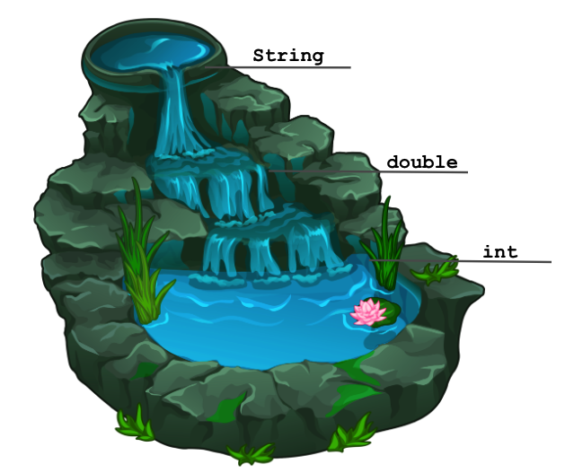

# Expressions 

<div style="position: relative; padding-bottom: 62.5%; height: 0;">
    <iframe src="https://www.youtube.com/embed/JgddtwEvTx8" frameborder="0" webkitallowfullscreen mozallowfullscreen allowfullscreen style="position: absolute; top: 0; left: 0; width: 100%; height: 100%;"></iframe>
</div>

:::{admonition} Note
:class: note

Above, you'll see there's a video titled **Expressions [Video Walkthrough]**. The video and the reading both have the same information! You're not required to go through both the video and the reading, as the video just walks through the reading to help contextualize it!
:::

## 🔢 Expressions

By now, you've worked a bit with data types such as `int`, `double`, `String`, and `boolean`.  In this lesson, we'll learn about how else we can use these values!  

Specifically, now that we can have notions of `5` and `3.14` in our programs, something you may be inclined to do is write a simple mathematical *expression* such as `5 + 3.14`.  Good news!  Java knows about math, and works the way you might expect!  (For the most part... more to come on this a bit further down the page.)


## ➕ Operators

The basic mathematical operators for addition (using `+`), subtraction (using `-`), multiplication (using `*`), and division (using `/`) are available in Java.  Each of these mathematical operators are **binary operators**, meaning they are used to combine two values (or operands) and each operation ***evaluates*** to a new value.  

Let's take a look at a few examples!  You'll see a code snippet below with expressions inside of `System.out.println` statements. Each expression *evaluates* to a resulting value, which is then printed out using the `println` statements! 

``` Java
public class ExpressionPractice{
    public static void main(String[] args) {
        System.out.println(3 + 5);
        System.out.println(6.9 + 1.145);
        System.out.println(5 * 10);
        System.out.println(18.5 / 2.5);
        System.out.println(10 / 3);
    }
}
```

Hit the "Run" button and take a look at the output. Are all of the results that are printed what you expected?  Take a close look at the last line...🤔 huh?  (keep reading ⬇️)


### ➗ Integer Division

The basic mathematical operators work as you would expect, *except* for the division operator when working with two `int` operands.  In the `10 / 3` example shown above, you may have expected to see something like `3.333`, but instead we see that the result evaluates to `3`. In this scenario, "int division" or "truncating division" is performed—-you can instead think of this as answering the question of "How many times does 3 fit evenly into 10?" where the answer is 3. Alternatively, you can do mathematical division and get an answer of `3.333`... , then remember that in this case we truncate everything to the right of the decimal point, giving us the final answer `3`. 

:::{admonition} Caution
:class: caution

Forgetting about integer division when working with `int`s is a **very common** source of bugs (bugs are coding errors in programs) when you're first starting out (and frequently comes back to haunt even the most experienced programmers).  

If you're noticing some strange `0`'s showing up where they shouldn't or some of your numerical results look off, check anywhere you're using division to make sure you're getting the results you expect! 🐛🐞
:::


### 😲 Modulo or "Mod" (%)

Java actually provides another mathematical operator that you may not have seen before: the **modulo** (or "mod" for short) operator, which uses the `%` character. This operator's result is what would be the *remainder* of an `int` division using the same two operands. For example, if we were to evaluate `10 % 3`, we would get `s` which is the *remainder* we get when evaluating `10 / 3`. Given this description, what do you expect `4 % 2`'s result to be? Take a moment to think before running the code below:

``` Java
public class ModuloPractice {
    public static void main(String[] args) {
        System.out.println(10 % 3);
        System.out.println(4 % 2);
        System.out.println(2 % 6);
    }
}
```


### 🧵 Dealing with Strings

So far we've only been talking about `int` and `double` types, but you've also been working with values of type `String`!  `String` values aren't able to work with the `*`, `-`, `/`, or `%` operators (if you try to use them, you will get a compiler error), but they do work with `+`!  When dealing with String values, `+` denotes concatenation which is a fancy way of saying "squishing `String`s together"!  Try running the code below to understand how `String` concatenation works!

``` Java
public class ConcatenationPractice {
    public static void main(String[] args) {
        System.out.println("Hello " + "everyone!");
        System.out.println("Java i" + "s so co" + "ol");
    }
}
```


### ⚙️ Relational and Logical Operators

**Relational operators** allow us to check the relationship between two **operands** (or values). We evaluate the expression using the relational operators to see if that relationship is `true` or `false`. Some of the basic relational operators can be seen below:

<link
    href="https://fonts.googleapis.com/css2?family=Fira+Code:wght@300;700&family=Open+Sans:wght@300;400;600;700;800&display=swap"
    rel="stylesheet"
/>

<style>
table {
    width: 100%;
    text-align: center;
    font-family: 'Open Sans';
    font-weight: 200;
    border: 1px solid black;
    border-collapse: collapse;
}
th {
    border: 1px solid black;
    border-collapse: collapse;
}

td {
    border: 1px solid black;
    border-collapse: collapse;
}

</style>

<table>
    <tr>
        <th>Operator</th>
        <th>Description</th>
        <th>Example</th>
    </tr>
    <tr>
        <td><code>==</code></td>
        <td>equal to</td>
        <td><code>3 == 9</code> returns <code>false</code></td>
    </tr>
    <tr>
        <td><code>!=</code></td>
        <td>not equal to</td>
        <td><code>3 != 9</code> returns <code>true</code></td>
    </tr>
    <tr>
        <td><code>></code></td>
        <td>greater than</td>
        <td><code>10 > 5</code> returns <code>true</code></td>
    </tr>
    <tr>
        <td><code><</code></td>
        <td>less than</td>
        <td><code>7 < 3</code> returns <code>false</code></td>
    </tr>
    <tr>
        <td><code>>=</code></td>
        <td>greater than or equal to</td>
        <td><code>2 <= 2</code> returns <code>true</code></td>
    </tr>
    <tr>
        <td><code><=</code></td>
        <td>less than or equal to</td>
        <td><code>10 <= 5</code> returns <code>false</code></td>
    </tr>
</table>
<br></br>

Alongside relational operators, we also have **logical operators**. Just like relational operators, they evaluate some expression to either `true` or `false`. But we can use logical operators to combine two or more **`boolean` expressions** or to get the opposite value of a particular **`boolean` expression**! Check out some logical operators below:

<link
    href="https://fonts.googleapis.com/css2?family=Fira+Code:wght@300;700&family=Open+Sans:wght@300;400;600;700;800&display=swap"
    rel="stylesheet"
/>

<style>
table {
    width: 100%;
    text-align: center;
    font-family: 'Open Sans';
    font-weight: 200;
    border: 1px solid black;
    border-collapse: collapse;
}
th {
    border: 1px solid black;
    border-collapse: collapse;
}

td {
    border: 1px solid black;
    border-collapse: collapse;
}

</style>

<table>
    <tr>
        <th>Operator</th>
        <th>Syntax</th>
        <th>Description</th>
        <th>Example</th>
    </tr>
    <tr>
        <td><code>&&</code> (logical AND)</td>
        <td><code>expression1 && expression2</code></td>
        <td>returns <code>true</code> if both expressions evaluate to <code>true</code></td>
        <th><code>8 > 4 && 14 != 7</code></th>
    </tr>
    <tr>
        <td><code>||</code> (logical OR)</td>
        <td><code>expression1 || expression2</code></td>
        <td>returns <code>true</code> if at least one of the expressions evaluates to <code>true</code></td>
        <th><code>8 % 2 == 0 || -8 < 0</code></th>
    </tr>
    <tr>
        <td><code>!</code> (logical NOT)</td>
        <td><code>!expression</code></td>
        <td>returns <code>true</code> if the expression is <code>false</code> and vice versa</td>
        <th><code>!(8.5 < -9.716)</code></th>
    </tr>

   
</table>

## 🤔 Expressions Using Different Types

We've notably only trying out examples where both of the operands share the same type.  What do you think would happen if we tried to use these operators using values of different types in an expression? Take a moment to think about some reasonable things Java could do given this scenario before clicking "Expand" below!

<details>
<summary>Expand</summary>
Java will *convert* one of the operands to the other operand's type, then it will perform the operation!  Here are how the conversions work: 

- ints can be converted to doubles 
  - e.g., 5.0 * 2 ➡️ 5.0 * 2.0
- ints can be converted to Strings
  - e.g., 5 + "hello" ➡️ "5" + "hello"
- doubles can be converted to Strings
  - e.g., "pickle" + 4.9 ➡️ "pickle" + "4.9"

You can think of these conversion rules like a waterfall: when two types are involved in an operation, the one higher up in the waterfall overtakes the one lower down!



:::{admonition} Danger
:class: Danger

You cannot combine values of type boolean with other types in an expression!  Java will give you a compiler error if you try.  
:::
</details>


## 📄 Precedence (Order of Operations)

Now that we've got a grasp of the basics, let's think about some more complicated expressions. When there are multiple operators involved in an expression (like `3 * 14.5 + 6 + "hi"`)  you have to think about **precedence**, or what order the parts of the expression (or **subexpressions**) are evaluated in. The PEMDAS order-of-operations trick that you may have learned in earlier school years applies here (with a few small tweaks) for non-boolean expressions.  


- **\[P\]**arentheses (`()`) - You can use parentheses in a Java expression in the same way that you can in a mathematical expression. Any subexpression that is inside of parentheses is performed before any other part of the expression.  

- **\[<strike>E</strike> M M D\]**
  - **<strike>E</strike> M**odulo (`%`) - There isn't a Java operator for "**e**xponents" (`^` actually does something different), but we can instead replace this with the **m**od operator. 
  - **M**ultiplication (`*`)
  - **D**ivision (`/`)
- **\[A S\]**
  - **A**ddition (`+`) - This really applies to the `+` operator, so both *addition* and `String` *concatenation* share this level of precedence! 
  - **S**ubtraction (`-`)


### 🎚 Levels of Precedence

Notice that we've grouped **m**od, **m**ultiplication, and **d**ivision together, and **a**ddition and **s**ubtraction have their own group. These groupings indicate the *levels of precedence*.  In other words, all of the operators within a level of precedence don't have priority over the others—in Java, when there are multiple subexpressions with the same level of precedence, they are executed **from left to right**.  

:::{admonition} Caution
:class: Caution

In classical mathematics, the order of doing multiplication and division in an expression didn't matter - the result would be the same. However, because in Java we are dealing not only with each subexpression's resulting value, but also its resulting type, the order of evaluation *does* matter!  
:::


### ❗ Precedence with `boolean`s

All of the operators discussed above (PMMDAS) have higher precedence than the relational and logical operators we've introduced **except for the "logical NOT" operator (`!`)**.  So specifically, the full list in their order of precedence, we have: 

- Logical NOT **`!`**

- Parentheses **`()`**

- Mod, Multiplication, and Division **`%`, `*`, `/`**

- Addition and Subtraction **`+`, `-`**

- Relational operators **`<`, `>`, `<=`, `>=`** (at the same level of precedence)

- Relational operators **`==`, `!=`** (at the same level of precedence)

- Logical AND **`&&`**

- Logical OR **`||`**

So you can generally evaluate any logical NOT operators, then perform all of the *non*-Boolean operations according to the PMMDAS precedence described above, and then evaluate each of the subexpressions involving relational operators (`<`, `>`, `<=`, `>=` before `==` and `!=`), then the subexpressions involving logical AND `&&`, and finally any remaining subexpressions involving logical OR `||`.  As described above, when there are multiple subexpressions with the same level of precedence, they are executed from left to right.  

Try running the code below to understand how these different operators work when used together!

``` Java
public class BooleanOperators {
    public static void main(String[] args) {
        System.out.println("5 < 20: " + (5 < 20));
        System.out.println("29.8 == 14825.7942: " + (29.8 == 14825.7942));
        System.out.println("18 % 2 != 0: " + (18 % 2 != 0));
        System.out.println("-6 < -6: " + (-6 < -6));
        System.out.println("-6 <= -6: " + (-6 <= -6));
        System.out.println("5 < 20 && -6 <= -6: " + (5 < 20 && -6 <= -6));
        System.out.println("5 < 20 && -6 < -6: " + (5 < 20 && -6 < -6));
        System.out.println("5 < 20 || -6 <= -6: " + (5 < 20 || -6 <= -6));
        System.out.println("5 < 20 || -6 < -6: " + (5 < 20 || -6 < -6));
        System.out.println("!(7.162 >= 7): " + !(7.162 >= 7));
    }
}

```
## Main Points:

- Java can combine data into expressions - many mathematical operators work as you expect (+, -, /, *, <, >). 

- There are additional operators that Java supports that you may not be familiar with (e.g., %, ==, !=, <=, >=, &&, ||, !). 

- When evaluating Java expressions, you also need to keep track of the types that are involved in each subexpression, as they sometimes affect how operators behave (e.g., int division). 

- Java obeys strict rules about precedence, and when there are multiple operators in an expression at the same level of precedence, subexpressions are evaluated in order from left to right. 

  - Java levels of precedence: \[!\] \[P\] \[MMD\] \[AS\] \[<><=>=\] \[== !=\] \[&&\] \[||\]
  