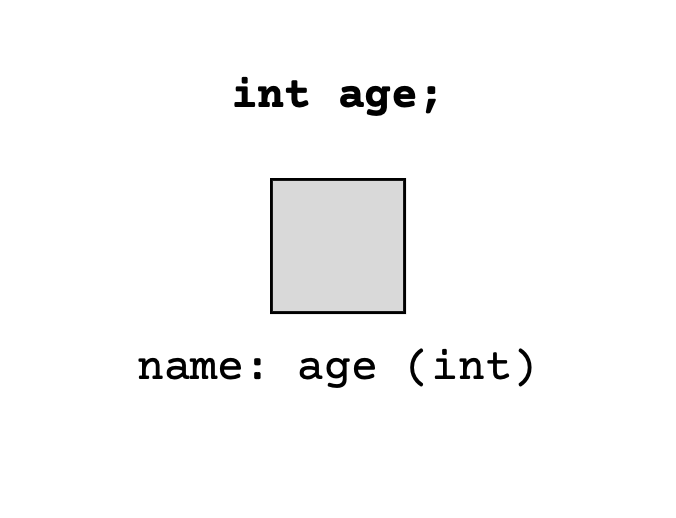
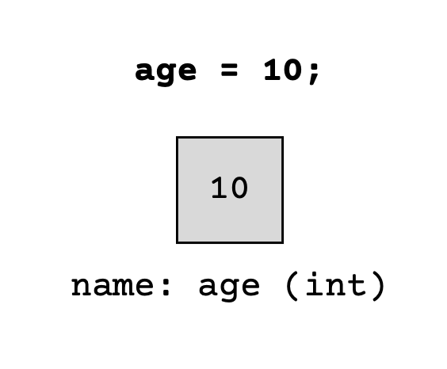

# Variables

<div style="position: relative; padding-bottom: 62.5%; height: 0;">
    <iframe src="https://www.youtube.com/embed/xBrruI-53nw" frameborder="0" webkitallowfullscreen mozallowfullscreen allowfullscreen style="position: absolute; top: 0; left: 0; width: 100%; height: 100%;"></iframe>
</div>

:::{admonition} Note
:class: note

Above, you'll see there's a video titled ***CSE 121: Variables Video Walkthrough***. The video and the reading both have the same information! You're not required to go through both the video and the reading, as the video just walks through the reading to help contextualize it!
:::

## ✏️  Variables

We've seen some different data types, but how do we use them to actually give labels to our data? **Variables** are just containers (or boxes) that store values of a specific data type. The process of creating these variables entails 2 distinct steps:

- **Declaration**: Specifying a *data* type (like `int`, `double`, or `String`) and a *name/label*

- **Initialization**: Storing a value into it


### Variable Declaration

Declaration creates a variable (container) in Java with a specific data type and a name/label. The syntax to declare a variable in Java is:

```
<data type> <name>;
```

Let's see this in practice! Suppose I wanted to declare an integer named `age`, I can do this with the statement:



:::{admonition} Tip
:class: tip

While Java doesn't really care about what names you give your variables, it's good practice to name them descriptively (so the name indicates what the value stored inside of it represents in your program). Variable names also conventionally use "camelCasing" where all of the words in the name are capitalized except for the first one. Here are a few examples: 
- `age`
- `dogName`
- `numOfFriends`
(The capitalized letters in the middle of the name are thought to look like the humps on a camel 🐫, hence the term.)
:::


### Variable Initialization

Initialization stores a value into a declared variable for the first time. The syntax to initialize a variable that was declared with a given name is:

```
<name> = <value>;
```

Suppose I wanted to initialize the integer named age (that we declared above), I can do this with the statement:



:::{admonition} Note
:class: note

Note that the value that you're initializing a variable with should have the same type as the variable that you declared (in the previous step). For example, you can initialize an `int` variable with the value `10` but you cannot initialize an `int` variable with the value `3.5` because it's not a whole number!
:::

### Putting it all together

Let's see both the declaration and initialization steps work together to create a variable. Let's create a `double` variable named gravity with the value `9.81`.  Try running the code block below to see how we can create this variable:

``` Java
public class Variables {
    public static void main(String[] args) {
        // Declare a variable with data type double named gravity
        double gravity;

        // Initialize the variable with value 9.81
        gravity = 9.81;
    }
}
```

Turns out, Java simplifies this process of declaration and initialization. You can combine the two steps into a single line as such:

``` Java
public class Variables {
    public static void main(String[] args) {
        // Declare and initialize a double named gravity with value 9.81
        double gravity = 9.81;
    }
}
```

Let's try some examples.

### Declare and Initialize a `String` named `movie` with the title of your favorite movie

We know that the best Java data type for a movie title is `String`, the name is `movie` and the value is... well your favorite movie. Suppose my favorite movie is Tangled - then we have two options of how to do this in Java.

Option 1:

``` Java
String movie;      // Declare a variable with data type String named movie
movie = "Tangled"; // Initialize the variable with value "Tangled"
```

Option 2:

``` Java
// Declare and initialize a String named movie with value "Tangled"
String movie = "Tangled";
```

### Create a variable called `imdbRating` that stores the value `5.6`

This one's slightly more tricky, because we aren't given the data type for this variable. We need to pick the right one! Try and decide which data type is appropriate for this example and create the variable declaration. The expand section below walks through the choice of data type, and shows the creation of the variable declaration. 

<details>
<summary>Expand</summary>

#### Data Types:

- **Integer**? No! 1 is not a whole number, and so we can't store it in an integer.

- **String**? Maybe... We've seen that we can store digits in a string (like "CSE 121") and we could create the string `"5.6"`, but is this is the most appropriate choice? Arguably not, because strings are used for storing text and `5.6` is a number - presumably, we want to treat it that way. 

- A **double** is the most appropriate option here! `5.6` is a decimal number, which is exactly what doubles are used to store.

#### Variable Declaration:

We've now decided on the data type (`double`), given the name (`imdbRating`) and the value (`5.6`). We have two options to do this in Java:

``` Java
// Option 1. 
double imdbRating; // Declare a variable with data type double named imdbRating
imdbRating = 5.6;  // Initialize the variable with value 5.6

// OR

// Option 2.
// Declare and initialize a double named imdbRating with value 5.6
double imdbRating = 5.6; 
```

</details>

## 💻 Working with variables

We've seen how to create variables, now let's use them in conjunction with `print` and `println` statements to display the information we stored. Explore the code sections below, try substituting different values for the variables and notice how the information presented to the user changes:

``` Java
public class Variables {
    public static void main(String[] args) {
        int age = 18;

        System.out.print("My age is: ");
        System.out.println(age); // We don't use quotes around age, because it's a variable
    }
}
```


We can use variables directly in `print` and `println` statements! 

``` Java
public class Variables {
    public static void main(String[] args) {
        int age = 21;
        double temp = 65.3;

        System.out.print("My age is: ");
        System.out.println(age); // We don't use quotes around age, because it's a variable
        
        System.out.print("The temperature outside is: ");
        System.out.println(temp); // We don't use quotes around temp, because it's a variable
    }
}
```

``` Java
public class Variables {
    public static void main(String[] args) {
        int age = 56;
        double temp = 65.3;
        String name = "Alice";
        
        System.out.print("My name is: ");
        System.out.println(name); // We don't use quotes around name, because it's a variable
        
        System.out.print("My age is: ");
        System.out.println(age); // We don't use quotes around age, because it's a variable
        
        System.out.print("The temperature outside is: ");
        System.out.println(temp); // We don't use quotes around temp, because it's a variable
    }
}
```
:::{admonition} Caution
:class: caution

Choosing the wrong data type for a variable is a common pitfall. Java will tell you if you do something illegal, like trying to store the value `10.2` into an integer data type. However, choosing the most appropriate data type for a variable is a really important design decision. 

As we saw above, Java would have allowed us to create a String variable to store `"5.6"` as the `imdbRating`, but `double` was really the most appropriate type considering what the data represented! 
:::

## Main Points

- Java uses *variables* to give names to store data and name it. Variables need to have a type and a name, and can store a value (of the correct type). 

- You create a variable with *declaration* and store a value inside it with *initialization* - Java will also let you do these two steps in one line of code. 