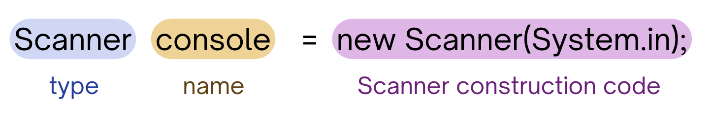

# User (Scanner) Input

<div style="position: relative; padding-bottom: 62.5%; height: 0;">
    <iframe src="https://www.youtube.com/embed/3CTbB4rWmCI?si=ZaGjz5LxfSijS8VH" frameborder="0" webkitallowfullscreen mozallowfullscreen allowfullscreen style="position: absolute; top: 0; left: 0; width: 100%; height: 100%;"></iframe>
</div>

:::{admonition} Note
:class: note

Above, you'll see there's a video titled **CSE 121: User Input (Scanners) Video Walkthrough**. The video and the reading both have the same information! You're not required to go through both the video and the reading, as the video just walks through the reading to help contextualize it!
:::

So far, we've been writing programs where we **hardcode** some values, or, directly write values we are dealing with into the program itself. Did you know there is a construct in Java that allows us to get information/values straight from the user <ins>through</ins> the console? 🙀 

We will be learning all about the `Scanner` object! This construct allows us even more flexibility in our programming by allowing us to write programs that execute some behavior based on information the user gives us directly! 

Now, our programs can display different behaviors on different runs solely based on what the user types (without making changes to the program itself)!

:::{note}
NOTE: `Scanners` are just like `Turtles` , however instead of using them to draw pictures, we use them to get the user's input. Just like how we can make the `Turtle` do particular things (i.e. "move") by making calls to particular methods, we can use methods on `Scanner`s to take in user input.
:::

## 🏗️  Creating a `Scanner`

Before we get into `Scanner` creation, make sure to have the line `import java.util.*;` at the very beginning of your class (before the class header) as shown below:

```java
import java.util.*; // Makes it so that we can use Scanners properly in our program
                    // We also did this for Random objects! 

public class Example { ...
```

Creating a `Scanner` is pretty similar to creating any other type of variable, however there is some important syntax to remember to ensure we are properly creating a `Scanner`.



1. The **type** (e.g. Scanner) - just like with any variable, when you create it you want to make clear what type the variable is. We can have variables of type `Scanner` by making sure you list the type as `Scanner`.

2. The **name** (e.g. console)- again, just like with any variables, we can name `Scanner` variables anything we want! You'll usually see them being named something along the lines of `console`, `input`, etc. but it's up to you what you'd like to name it!

3. **Scanner construction code** (e.g. new System(System.in) - to **construct** or create a new `Scanner` variable, you <ins>must</ins> have `new Scanner(System.in);` after the equal sign when creating a `Scanner` variable. This code helps ensure that we are properly constructing a new `Scanner` variable. Note that `new` is a keyword needed to create an instance of a `Scanner`

Below is some code that attempts to construct a `Scanner` If we **run** it, we run into an error. 
:::{note}
Try fixing the code so that it runs properly!
:::
```java
import java.util.*; // make sure to have this whenever you are using Scanners

public class Example {
    public static void main(String[] args) {
        // code below to create a new Scanner variable

        // something is wrong with it! try editing it so that this 
        // properly creates a Scanner
        Scanner console = Scanner(System.in);
    }
}
```

:::{dropdown} Expand
Remember that in order to correctly create a `Scanner` to take user input from the console, we must have everything in the line below:

```java
Scanner name = new Scanner(System.in);
```

In the code above, we forgot the `new` keyword on the right side of the equal sign on line 9.
:::
Now that we've created a `Scanner`, how exactly can we use it to get user input? It's time to review important `Scanner` methods for user input!

Like mentioned earlier, we can use methods for `Scanners` in the same way we've used them for `Turtles` by **calling them** on a particular `Scanner` variable.

## 🔑  `Scanner` Methods: `.next()`

The first method we are learning about is `.next()`. By calling this method on a `Scanner` we are asking the user for <ins>one singular token</ins>. We define a token as a unit of input separated by some *whitespace* (e.g. spaces, tabs, etc.). 

This token of information that we ask the user for will be *returned* to us as a value of type `String`. 

Try **running** the code below!
```java
import java.util.*; // make sure to have this whenever you are using Scanners

public class Example {
    public static void main(String[] args) {
        // code to create a new Scanner variable
        Scanner console = new Scanner(System.in);

        // prompt that we write for the user so they know what information to input
        System.out.print("what is your first name? ");

        // call to .next() that will return the user input as a String!
        String userName = console.next();

        // using the user's input!
        System.out.println("Hello " + userName + "!");
    }
}
```
Notice that the program will print to the console `"what is your first name? "` and waits. It is waiting for you (the user) to enter some information into the console and press **enter** after that.

When you press enter, it will return whatever you typed into the console to the program itself. We can store that return into a variable and use it later!

:::{note}
Try **running** the program again and enter your first name! Run it multiple times with different first names to see how the program is truly using the user input from the console.
:::

## 🔑  `Scanner` Methods: `.nextLine()`

The next method we'll learn about is `nextLine()`. This is just like `.next()` where we will return user input as a `String`, but instead of just one token (or one unit of information), we can enter *multiple* words, separated by spaces!

Try running the code below and instead of just inputting your first name, try inputting your **full name**:
```java
import java.util.*; // make sure to have this whenever you are using Scanners

public class Example {
    public static void main(String[] args) {
        // code to create a new Scanner variable
        Scanner console = new Scanner(System.in);
        System.out.print("what is your full name? ");

        // call to .nextLine() that will return the user input as a String!
        String userFullName = console.nextLine();

        // using the user's input!
        System.out.println("Hello " + userFullName + "!");
    }
}
```

## 🔑  `Scanner` Methods: `.nextInt()` and `.nextDouble()`

The last set of `Scanner` methods we'll learn about are `nextInt()` and `nextDouble()`. They work very similarly to `next()`. However, calls to `nextInt()` will return the user input as an `int` (if possible) and calls to `nextDouble()` will return the user input as a `double` (if possible). 

Notice that we mention it will return as that particular type (*if possible*). 

:::{note}
**Try running the code block below**. When the program prompts you to `enter a whole number:`, input something that is <ins>**not**</ins> a whole number (i.e. "hello" or 3.27).
:::
```java
import java.util.*; // make sure to have this whenever you are using Scanners

public class Example {
    public static void main(String[] args) {
        // code to create a new Scanner variable
        Scanner console = new Scanner(System.in);

        // prompting the user for an integer
        System.out.print("please enter a whole number: ");
        // call to .nextInt() that will return the user input as a int (if possible)!
        int userInt = console.nextInt();

        // prompting the user for a double
        System.out.print("please enter a decimal number: ");
        // call to .nextDoubole() that will return the user input as a double (if possible)!
        double userDouble = console.nextDouble();

        // doing things with the user input
        double product = userInt * userDouble;
        System.out.println("the product of those numbers is " + product);

    }
}
```

If you followed the instructions above, you should see that we get an exception called `InputMismatchException` and our program ceases to run.

This is because we entered some input that can not be read in as the requested type (`int`). 

:::{note}
**Exceptions** are an events, which occur during the execution of a program, that disrupts the normal flow of the program's instructions. Exceptions are usually very clearly labeled so you understand what the actual issue is (e.g. `InputMismatchException`, `IndexOutOfBoundsException`, etc.).
:::

:::{caution}
When you use `nextInt()` and `nextDouble()`, the user must input something that can be read as an `int` and `double`  (respectively) so that the program runs!
:::

Now try **running** the program again. This time, try entering values of the correct type.

## Main Points
- The `Scanner` object allows us to take in user input that we can later use throughout our code.
- We create a new `Scanner` object by using the syntax `Scanner console = new Scanner(System.in);`
    * `Scanner` is the **type** of variable we are creating.
    * `console` is what we named our variable (we can name it anything, but we usually want to be descriptive and name it either `console` or `scan`).
    * `new Scanner(System.in)` is our code for **constructing** the `Scanner`, which is necessary for us to properly create a `Scanner` object.
- `Scanner` objects have methods that characterize what type of user input we want to take in.
    * `.next()` takes in the first token of the user's input (everything that appears before a space or when the user hits enter - whichever comes first).
    * `.nextLine()` takes in the entire line of the user's input (everything that appears before the user hits enter).
    * ``.nextInt()`` takes in an integer that the user enters.
    * ``.nextDouble()` takes in a double that the user enters.
- When using the ``.nextInt()` and `.nextDouble()` methods, an `InputMismatchException` may occur if the user enters a `String` instead.
- Sample code:
```java
Scanner scan = new Scanner(System.in);

System.out.print("Enter a name: ");
String name = scan.next();  // Example: if the user enters Kailey, the value of num is "Kailey"

System.out.print("Enter a number: ");
int num = scan.nextInt();  // Example: if the user enters an integer, 
                           // that integer will be stored inside of num, otherwise InputMismatchException 
                           // (even if the user enters a double)
```