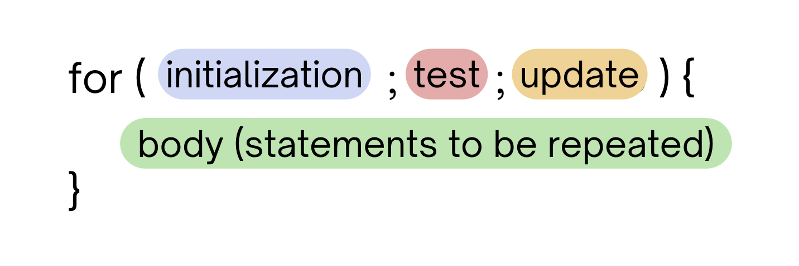
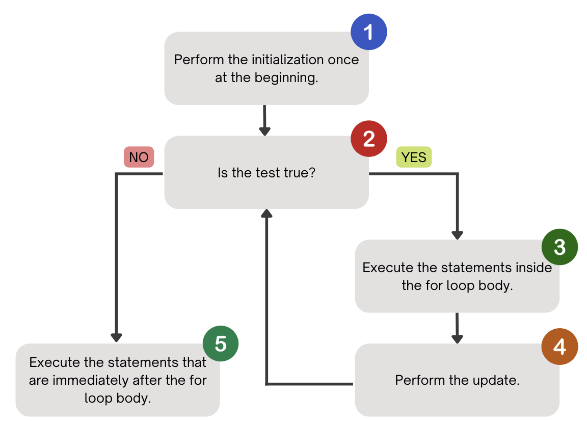

# Introduction to For Loops

<div style="position: relative; padding-bottom: 62.5%; height: 0;">
    <iframe src="https://www.youtube.com/embed/9Oogvp74wao" frameborder="0" webkitallowfullscreen mozallowfullscreen allowfullscreen style="position: absolute; top: 0; left: 0; width: 100%; height: 100%;"></iframe>
</div>

:::{admonition} Note
:class: note

Above, you'll see there's a video titled **CSE 121: For Loops Video Walkthrough**. The video and the reading both have the same information! You're not required to go through both the video and the reading, as the video just walks through the reading to help contextualize it!
:::


Say that I wanted to write a program that prints `"I love CSE 121!"` five times over. With the concepts we have learned about up to this point, we'd have code that looks something like this:


``` java
public class Example {
    public static void main(String[] args) {
        System.out.println("I love CSE 121!");
        System.out.println("I love CSE 121!");
        System.out.println("I love CSE 121!");
        System.out.println("I love CSE 121!");
        System.out.println("I love CSE 121!");
    }
}
```


If we run this program, we can see that it works – it prints "I love CSE 121!" five times. However, this isn't the most convenient way to write this program. What if we wanted to print the same line five more times? Would we just type in five more System.out.println() statements?


When programming, you'll often find that there's certain statements, or lines of code, that you want to repeat over and over again. Luckily, we have a construct in programming that enables us to do exactly that called the for loop.


## About the For Loop

As mentioned previously, **the for loop** is a programming construct that allows for a set of controlled statements (or lines of code) to be repeated a ***set number of times***. We will typically use for loops for what we call **definite loops**, meaning that when we write a for loop, we will write it in such a way that we know exactly how many times the loop should run.

## For Loop Syntax



The **for loop** contains four key elements: 

1. The **initialization** – in this step, we set up a variable that acts as a *counter*. It helps keep track of how many times we have *iterated* in the loop or have taken a turn around the for loop. Usually in this step, we are setting up a new `int` variable as our counter.
2. The **test** – in this step, we are checking whether or not to continue iterating in the for loop by way of a *continuation test*. This should take the form of some statement that can be evaluated as `true` or `false`. The test usually is checking the value of the counter variable against some other value (e.g. `num < 5`). When we look at the test, we must determine whether the relationship of the two values is true or false, which will help us determine if we should continue in the loop.
3. The **update** – if we reach this step, this means the test has evaluated to true and we can take another turn in the for loop. The update usually involves `incrementing` or adding one to our counter variable, but we're not limited to just adding one!
4. The **body** – this is the set of controlled statements that will be *executed* or run every time we take another iteration in the for loop.


## Writing a For Loop

How exactly do we write each of the important components of the for loop?

1. We perform the **initialization**, where we set up our counter variable. This happens *once*, only at the beginning of running the for loop. We only need to create this variable once, after that we are able to update it properly and get an accurate picture of how many times the loop has run. When starting off writing for loops, you can usually start it from 1. 

``` Java
// example for loop, starting with the initialization
for (int counter = 1; test; update) {
    body
}
```

2. Next, we write the **update**! Usually in this step, we are just incrementing the counter by 1. However, based on what exactly you're doing in the for loop, you can choose to increment it by a different amount. For now, we will just increment by 1. (Check out the section below for more syntax on how to *increment* a variable). You'll usually see it written like below.

``` Java
// example for loop, adding the update
for (int counter = 1; test; counter++) {
    body
}
```

3. Next, we write the **test**. As mentioned before, the test will usually look something like comparing our counter variable from step 1 to some value, depending on how many times you want to loop. If our variable from step 1 is counting how many times we are looping in the for loop, our test should be checking that we are not exceeding the amount of times we want to loop. In our example for loop, if we wanted to repeat our code three times, we should be checking that *it is true our counter variable is less than or equal to three*. 

``` Java
// example for loop, incorporating the test
for (int counter = 1; counter <= 3; counter++) {
    body
}
```

4. Finally, we want to write the **body** or the lines of code we want to be repeated over and over again.

``` Java
// example for loop, adding the body
for (int counter = 1; counter <= 3; counter++) {
    System.out.println(counter);
}
```

## Incrementing a Variable

As mentioned above, when we write a for loop header (specifically in our update), we want to be able to increment our counter variable by some amount. Usually in for loops, we'll be adding 1!

In Java, we have a lot of different ways to take the current value of a variable, add some value to it, and reset that variable's value to be the incremented amount.

In the block of code below, you'll see a lot of shorthand syntax to add 1 to a variable. You'll usually see `num++`, but any of the syntax below could also be used!

``` Java
public class Example {
    public static void main(String[] args) {
        int num = 0;
        // all of the lines of code operate the same way!
        // it's all just different syntax
        num = num + 1; 
        num += 1;
        num++;
        System.out.println(num);
    }
}
```

## For Loop Control Flow and Application Example

How do all four of these elements come together? Check out the **for loop control flow** diagrammed below:



Code for the beginning example below

:::{admonition} Expand
:class: dropdown

Code for the beginning example below:

``` Java
for (int counter = 1; counter <= 5; counter++) {
    System.out.println("I love CSE 121!");
}
```
:::

:::{tip}
:class: tip

To see this control flow in action with an nexample for loop, be sure to check out **13:10** of the For Loops Video Walkthrough!
:::